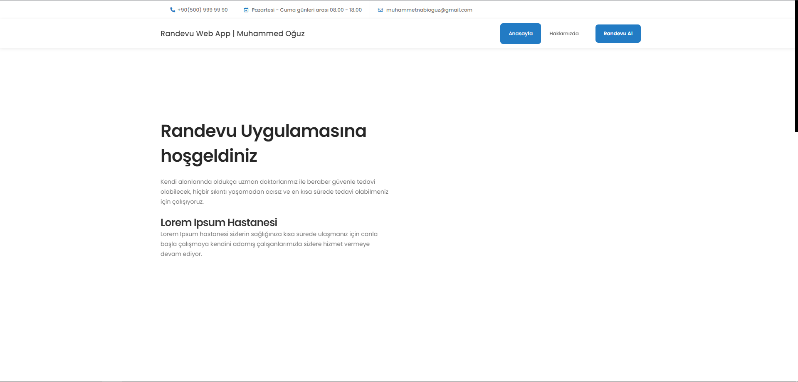
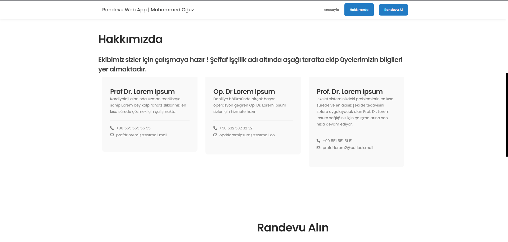
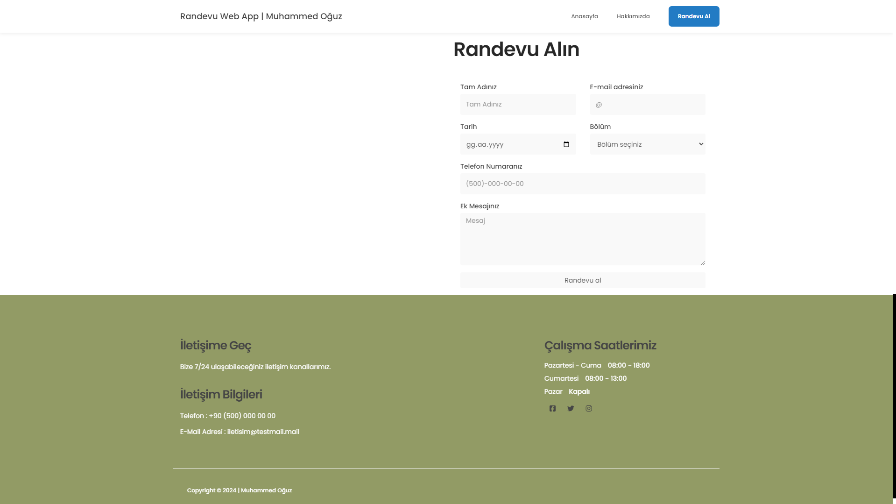

# Randevu Uygulaması Web App 

#### Tek sayfalık randevu uygulaması. Basit açıklamalar ile proje kişisel olarak değiştirilebilir. Aşağıya kaydırıldığında girilen değerler ``./data/`` klasörü altındaki  ``./randevular.json`` dosyası içerisinde kayıtlar tutulur.

## Proje Nasıl Başlatılır ? 

#### - Kişisel bilgisayar içerisine XAMPP kurulumunu yapılır. 

#### - Proje ``C:/xampp/htdocs/`` klasör yolu içerisine girilir ve proje içeriye kopyalanır.

#### - XAMPP ile apache server çalıştırılır. ``http://localhost/appointment-project`` url'i takip edilir. ve proje çalıştırılır. 

## Proje görüntüleri 

